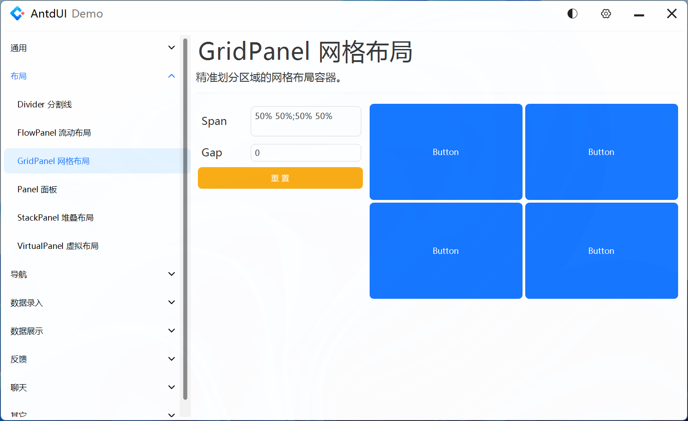
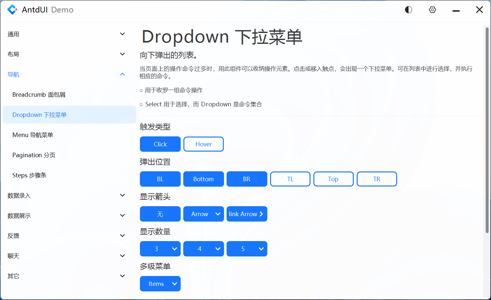
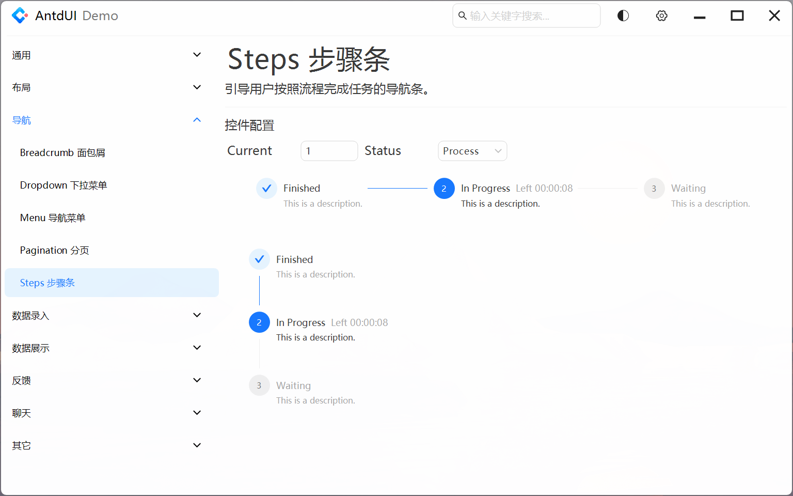
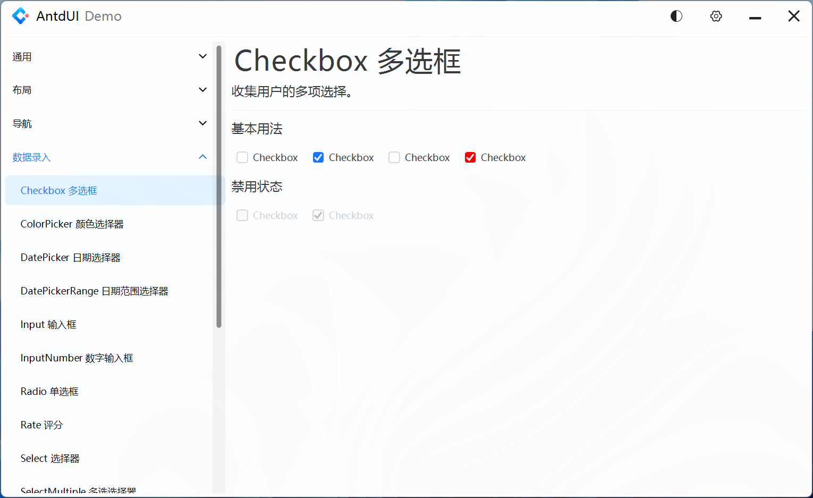

# AntdUIDemo

本项目基于 Winform .NET Framework 4.8 开发，是 [AntdUI](https://gitee.com/antdui/AntdUI) 的 Demo 项目，当前版本 `1.5.7-beta`

## ✅ 快速开始
```
1. git clone 或者直接下载本项目

2. 若电脑分辨率不是 1920×1080(1080P) 或者缩放不是 100%，
   使用 Visual Studio 在 100% 缩放模式下(使用 devenv /noScale 命令启动 Visual Studio)打开项目,
   或者在项目窗口选择使用 100% 缩放比例重新启动 Visual Studio

3. 若电脑没有安装 .NET Framework 4.8,编辑项目文件设置 TargetFramework 属性为自己安装的目标框架，兼容框架参照 AntdUI 项目

4. 编译运行
```
## ⚠️ 注意事项
- 电脑屏幕分辨率低于 1920×1080(1080P) 请使用大于等于 1080P 分辨率的屏幕开发
- 电脑屏幕分辨率大于 1080P 或者缩放不是 100% 的，可选择以下任一方式运行项目
	- 按照上述 **快速开始** 的第二条打开项目，详细原因见 [解决 Visual Studio 中 Windows 窗体设计器的 HDPI/缩放问题](https://learn.microsoft.com/zh-cn/visualstudio/designers/disable-dpi-awareness?view=vs-2022) ，如下所示	

	- 直接打开项目，在窗口页面提示点击 **使用 100% 缩放比例重新启动 Visual Studio**，如下所示


## 系统设置
- ✅ 支持浅色/深色模式，并且随系统自动切换
- ✅ 支持启用/关闭动画效果
- ✅ 支持启用/关闭阴影效果
- ✅ 支持显示/隐藏滚动条
- ✅ 支持设置 Message/Notification 消息显示位置


## 控件演示

### 通用
#### Button 按钮

#### FloatButton 悬浮按钮


### 布局
#### FlowPanel 流动布局

#### GridPanel 网格布局

#### Panel 面板

#### StackPanel 堆叠布局


### 导航
#### Dropdown 下拉菜单

#### Menu 导航菜单

#### Pagination 分页

#### Steps 步骤条


### 数据录入
#### Checkbox 复选框

#### ColorPicker 颜色选择器

#### DatePicker 日期选择器

#### DatePickerRange 日期范围选择器

#### Input 输入框
#### InputNumber 数字输入框
#### Radio 单选框
#### Rate 评分
#### Select 选择器
#### SelectMultiple 多选选择器
#### Slider 滑动输入条
#### Switch 开关
#### TimePicker 时间选择框

### 数据展示
#### Avatar 头像
#### Badge 徽标数
#### Calendar 日历
#### Carousel 走马灯
#### Label 标签
#### Popver 气泡卡片
#### Preview 图片预览
#### Segmented 分段控制器
#### Table 表格
#### Tabs 标签页
#### Tag 标签
#### Timeline 时间轴
#### Tooltip 文字提示
#### Tree 树形控件

### 反馈
#### Alert 警告提示
#### Drawer 抽屉
#### Message 全局提示
#### Modal 对话框
#### Notification 通知提醒框
#### Progress 进度条
#### Spin 加载中

### 聊天
#### ChatList 气泡聊天列表
#### MsgList 好友消息列表

### 其它
#### Battery 电池
#### ContextMenuStrip 右键菜单
#### Divider 分割线
#### Image3D 图片3D
#### WindowBar 窗口栏