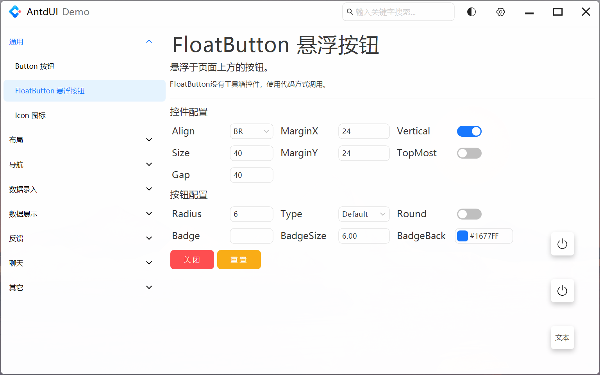
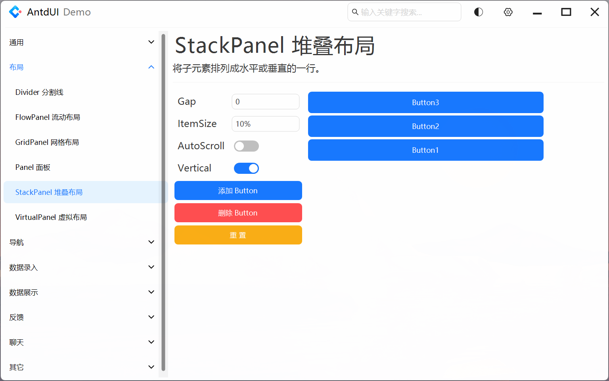

# AntdUIDemo

本项目基于Winform .NET Framework 4.8开发，是 [AntdUI](https://gitee.com/antdui/AntdUI) 的Demo项目

## ✅ 快速开始
```
1. git clone 或者直接下载本项目

2. 若电脑缩放不是100%，使用 Visual Studio 在100%缩放模式下(命令行使用 devenv /noScale 命令启动 Visual Studio)打开项目

3. 若电脑没有安装.NET Framework 4.8,编辑项目文件设置 TargetFramework 属性为自己安装的目标框架，兼容框架参照 AntdUI 项目

4. 编译运行
```

## 控件演示

### 通用
#### Button

#### FloatButton


### 布局
#### FlowPanel

#### GridPanel

#### Panel

#### StackPanel


### 导航
#### 下拉菜单
#### 导航菜单
#### 分页
#### 步骤条

### 数据录入
#### 复选框
#### 颜色选择器
#### 日期选择器
#### 日期范围选择器
#### 输入框
#### 数字输入框
#### 单选框
#### 评分
#### 选择器
#### 多选选择器
#### 滑动输入条
#### 开关
#### 时间选择框

### 数据展示
#### 头像
#### 徽标数
#### 日历
#### 走马灯
#### 标签
#### 气泡卡片
#### 图片预览
#### 分段控制器
#### 表格
#### 标签页
#### 标签
#### 时间轴
#### 文字提示
#### 树形控件

### 反馈
#### 警告提示
#### 抽屉
#### 全局提示
#### 对话框
#### 通知提醒框
#### 进度条
#### 加载中

### 聊天
#### 气泡聊天列表
#### 好友消息列表

### 其它
#### 电池
#### 右键菜单
#### 分割线
#### 图片3D
#### 窗口栏