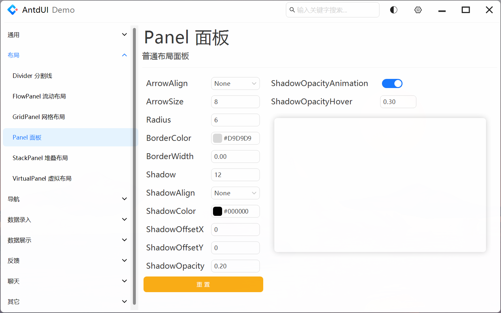

# AntdUIDemo

本项目基于Winform .NET Framework 4.8开发，是 [AntdUI](https://gitee.com/antdui/AntdUI) 的Demo项目

## ✅ 快速开始
```
1. git clone 或者直接下载本项目

2. 若电脑缩放不是100%，使用 Visual Studio 在100%缩放模式下(命令行使用 devenv /noScale 命令启动 Visual Studio)打开项目

3. 若电脑没有安装.NET Framework 4.8,编辑项目文件设置 TargetFramework 属性为自己安装的目标框架，兼容框架参照 AntdUI 项目

4. 编译运行
```

## 控件演示

### Button

### FloatButton

### FlowPanel

### GridPanel

### Panel

### StackPanel
